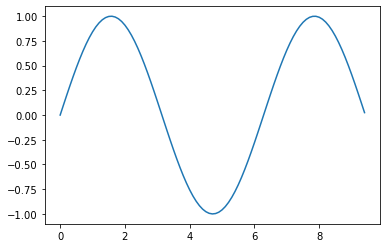
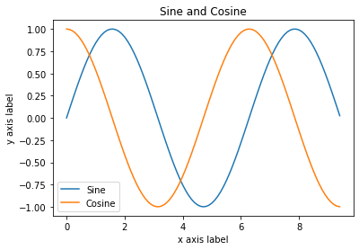
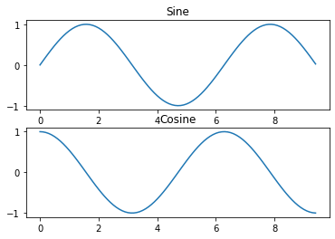

## CS231n Numpy Tutorial 📚
from: https://cs231n.github.io/python-numpy-tutorial/#numpy


```python
# Arrays
import numpy as np

a = np.array([1, 2, 3])   # Create a rank 1 array
print(type(a))            # Prints "<class 'numpy.ndarray'>"
print(a.shape)            # Prints "(3,)"
print(a[0], a[1], a[2])   # Prints "1 2 3"
a[0] = 5                  # Change an element of the array
print(a)                  # Prints "[5, 2, 3]"

b = np.array([[1,2,3],[4,5,6]])    # Create a rank 2 array
print(b.shape)                     # Prints "(2, 3)" 先直的再橫的
print(b[0, 0], b[0, 1], b[1, 0])   # Prints "1 2 4"
```

    <class 'numpy.ndarray'>
    (3,)
    1 2 3
    [5 2 3]
    (2, 3)
    1 2 4
    


```python
a = np.zeros((2,2))   # Create an array of all zeros
print(a)              


b = np.ones((1,2))    # Create an array of all ones
print(b)              


c = np.full((2,2), 7)  # Create a constant array
print(c)               


d = np.eye(2)         # Create a 2x2 identity matrix
print(d)              


e = np.random.random((2,2))  # Create an array filled with random values
print(e)                     
```

    [[0. 0.]
     [0. 0.]]
    [[1. 1.]]
    [[7 7]
     [7 7]]
    [[1. 0.]
     [0. 1.]]
    [[0.14279157 0.32610843]
     [0.69136273 0.53776594]]
    


```python
# https://numpy.org/doc/stable/user/basics.creation.html#arrays-creation
x1 = np.array([2, 3, 1, 0])

x2 = np.array([[1,2.0],[0,0],(1+1j,3.)]) # note mix of tuple and lists, and types

x3 = np.array([[ 1.+0.j, 2.+0.j], [ 0.+0.j, 0.+0.j], [ 1.+1.j, 3.+0.j]])

print(x1)
print(x2)
print(x3)
```

    [2 3 1 0]
    [[1.+0.j 2.+0.j]
     [0.+0.j 0.+0.j]
     [1.+1.j 3.+0.j]]
    [[1.+0.j 2.+0.j]
     [0.+0.j 0.+0.j]
     [1.+1.j 3.+0.j]]
    


```python
# arange（）將創建具有規則遞增值的數組 (create arrays with regularly incrementing values.)
#  range(start, stop[, step]) 
n1 = np.arange(10)
print(n1)

# 2到10之間，以float印出
n2 = np.arange(2, 10, dtype=float)
print(n2)

# 2到3之間，以0.1維間隔
n3 = np.arange(2, 3, 0.1)
print(n3)
```

    [0 1 2 3 4 5 6 7 8 9]
    [2. 3. 4. 5. 6. 7. 8. 9.]
    [2.  2.1 2.2 2.3 2.4 2.5 2.6 2.7 2.8 2.9]
    


```python
# linspace() 創建具有指定數量的元素的數組，並在指定的開始值和結束值之間平均隔開
#  1到4之間，取6個
np.linspace(1., 4., 6)
```


    array([1. , 1.6, 2.2, 2.8, 3.4, 4. ])


```python
# index（）將創建一組array（堆疊為一維數組(stacked as a one-higher dimensioned array)），每個維一個，每個維表示該維的變化
# ??
grid = np.indices((2, 3))
print(grid)

grid.shape
```

    [[[0 0 0]
      [1 1 1]]
    
     [[0 1 2]
      [0 1 2]]]
    


    (2, 2, 3)


```python
# Array indexing - Slicing
a = np.array([[1,2,3,4], [5,6,7,8], [9,10,11,12]])
print(a.shape)


b = a[:2, 1:3] 
print(b)


print(a[0, 1])   # Prints "2"
b[0, 0] = 77     # b[0, 0] is the same piece of data as a[0, 1]
print(a[0, 1])   # Prints "77"
```

    (3, 4)
    [[2 3]
     [6 7]]
    2
    77
    


```python
a = np.array([[1,2,3,4], [5,6,7,8], [9,10,11,12]])
print(a.shape)


row_r1 = a[1, :]    # Rank 1 view of the second row of a
row_r2 = a[1:2, :]  # Rank 2 view of the second row of a
print(row_r1, row_r1.shape)  # Prints "[5 6 7 8] (4,)"
print(row_r2, row_r2.shape)  # Prints "[[5 6 7 8]] (1, 4)"


col_r1 = a[:, 1]
col_r2 = a[:, 1:2]
print(col_r1, col_r1.shape)  # Prints "[ 2  6 10] (3,)"
print(col_r2, col_r2.shape)  # Prints "[[ 2]
                             #          [ 6]
                             #          [10]] (3, 1)"
```

    (3, 4)
    [5 6 7 8] (4,)
    [[5 6 7 8]] (1, 4)
    [ 2  6 10] (3,)
    [[ 2]
     [ 6]
     [10]] (3, 1)
    


```python
# Integer array indexing
a = np.array([[1,2], [3, 4], [5, 6]])
print(a.shape)

# The returned array will have shape (3,) and
print(a[[0, 1, 2], [0, 1, 0]])  # Prints "[1 4 5]"
# 即a[0,0] a[1,1] a[2,0]

# The above example of integer array indexing is equivalent to this:
print(np.array([a[0, 0], a[1, 1], a[2, 0]]))  # Prints "[1 4 5]"

# When using integer array indexing, you can reuse the same
# element from the source array:
print(a[[0, 0], [1, 1]])  # Prints "[2 2]"

# Equivalent to the previous integer array indexing example
print(np.array([a[0, 1], a[0, 1]]))  # Prints "[2 2]"
```

    (3, 2)
    [1 4 5]
    [1 4 5]
    [2 2]
    [2 2]
    


```python
a = np.array([[1,2,3], [4,5,6], [7,8,9], [10, 11, 12]])
print(a)  


# Create an array of indices
b = np.array([0, 2, 0, 1])

# Select one element from each row of a using the indices in b
print(a[np.arange(4), b])  # Prints "[ 1  6  7 11]"
# a[0,0] a[1,2] a[2,0] a[3,1] 

# Mutate one element from each row of a using the indices in b
a[np.arange(4), b] += 10
print(a)  
```

    [[ 1  2  3]
     [ 4  5  6]
     [ 7  8  9]
     [10 11 12]]
    [ 1  6  7 11]
    [[11  2  3]
     [ 4  5 16]
     [17  8  9]
     [10 21 12]]
    


```python
a = np.array([[1,2], [3, 4], [5, 6]])

bool_idx = (a > 2)   

print(bool_idx)

# We use boolean array indexing to construct a rank 1 array
# consisting of the elements of a corresponding to the True values
# of bool_idx
print(a[bool_idx])  # Prints "[3 4 5 6]"


# We can do all of the above in a single concise statement:
print(a[a > 2])     # Prints "[3 4 5 6]"
```

    [[False False]
     [ True  True]
     [ True  True]]
    [3 4 5 6]
    [3 4 5 6]
    


```python
# Datatypes
x = np.array([1, 2])   # Let numpy choose the datatype
print(x.dtype)         # Prints "int64"

x = np.array([1.0, 2.0])   # Let numpy choose the datatype
print(x.dtype)             # Prints "float64"

x = np.array([1, 2], dtype=np.int64)   # Force a particular datatype
print(x.dtype)                         # Prints "int64"
```

    int32
    float64
    int64
    


```python
# argmax這個功能會尋找你所指定的維度之中，最大值所在之處的 "索引值"
x = np.array([[1, 2, 3], [6, 5, 5], [7, 8, 9]])
# 比 (1,6,7) (2,5,8) (3,5,9)
m1 = x.argmax(axis=0)
print(m1)

# 比 (1,2,3) (6,5,5) (7,8,9)
m2 = x.argmax(axis=1)
print(m2)
```

    [2 2 2]
    [2 0 2]
    


```python
# Array math
x = np.array([[1,2],[3,4]], dtype=np.float64)
y = np.array([[5,6],[7,8]], dtype=np.float64)

# Elementwise sum; both produce the array
print(x + y)
print(np.add(x, y))

# Elementwise difference; both produce the array
print(x - y)
print(np.subtract(x, y))

# Elementwise product; both produce the array
print(x * y)
print(np.multiply(x, y))

# Elementwise division; both produce the array
print(x / y)
print(np.divide(x, y))

# Elementwise square root(平方根); produces the array
print(np.sqrt(x))
```

    [[ 6.  8.]
     [10. 12.]]
    [[ 6.  8.]
     [10. 12.]]
    [[-4. -4.]
     [-4. -4.]]
    [[-4. -4.]
     [-4. -4.]]
    [[ 5. 12.]
     [21. 32.]]
    [[ 5. 12.]
     [21. 32.]]
    [[0.2        0.33333333]
     [0.42857143 0.5       ]]
    [[0.2        0.33333333]
     [0.42857143 0.5       ]]
    [[1.         1.41421356]
     [1.73205081 2.        ]]
    


```python
x = np.array([[1,2],[3,4]])
y = np.array([[5,6],[7,8]])

v = np.array([9,10])
w = np.array([11, 12])

# Inner product of vectors; both produce 219
print(v.dot(w))
print(np.dot(v, w))

# Matrix / vector product; both produce the rank 1 array
print(x.dot(v))
print(np.dot(x, v))

# Matrix / matrix product; both produce the rank 2 array
print(x.dot(y))
print(np.dot(x, y))
```

    219
    219
    [29 67]
    [29 67]
    [[19 22]
     [43 50]]
    [[19 22]
     [43 50]]
    


```python
x = np.array([[1,2],[3,4]])

print(np.sum(x))  # Compute sum of all elements
print(np.sum(x, axis=0))  # Compute sum of each column
print(np.sum(x, axis=1))  # Compute sum of each row
```

    10
    [4 6]
    [3 7]
    


```python
x = np.array([[1,2], [3,4]])
print(x)    
print(x.T)

# Note that taking the transpose of a rank 1 array does nothing:
v = np.array([1,2,3])
print(v)    
print(v.T)  
```

    [[1 2]
     [3 4]]
    [[1 3]
     [2 4]]
    [1 2 3]
    [1 2 3]
    


```python
# Broadcasting
x = np.array([[1,2,3], [4,5,6], [7,8,9], [10, 11, 12]])
v = np.array([1, 0, 1])
y = np.empty_like(x)   # Create an empty matrix with the same shape as x


for i in range(4):
    y[i, :] = x[i, :] + v

# y[0, :] = x[0, :]+ [1,0,1]
# 即[x, x, x] = [1,2,3]+[1,0,1]= [2,2,4]

# y[1, :] = x[1, :]+ [1,0,1]
# 即[x, x, x] = [4,5,6]+[1,0,1]= [5,5,7]

print(y)
```

    [[ 2  2  4]
     [ 5  5  7]
     [ 8  8 10]
     [11 11 13]]
    


```python
x = np.array([[1,2,3], [4,5,6], [7,8,9], [10, 11, 12]])
v = np.array([1, 0, 1])
vv = np.tile(v, (4, 1))   # Stack 4 copies of v on top of each other
print(vv)    
print(vv.shape)

y = x + vv  
print(y) 
```

    [[1 0 1]
     [1 0 1]
     [1 0 1]
     [1 0 1]]
    (4, 3)
    [[ 2  2  4]
     [ 5  5  7]
     [ 8  8 10]
     [11 11 13]]
    


```python
v = np.array([1,2,3])  # v has shape (3,)
w = np.array([4,5])    # w has shape (2,)

print(np.reshape(v, (3, 1)))
print(np.reshape(v, (3, 1)) * w)
# np.reshape(v, (3, 1)) = [[1] [2] [3]]
# [[1] [2] [3]]*[4,5] 

# Add a vector to each row of a matrix
x = np.array([[1,2,3], [4,5,6]])
print(x + v)

print((x.T + w).T)
print(x + np.reshape(w, (2, 1)))

print(x * 2)
```

    [[1]
     [2]
     [3]]
    [[ 4  5]
     [ 8 10]
     [12 15]]
    [[2 4 6]
     [5 7 9]]
    [[ 5  6  7]
     [ 9 10 11]]
    [[ 5  6  7]
     [ 9 10 11]]
    [[ 2  4  6]
     [ 8 10 12]]
    


```python
# Matplotlib
import numpy as np
import matplotlib.pyplot as plt

# Compute the x and y coordinates for points on a sine curve
x = np.arange(0, 3 * np.pi, 0.1)
y = np.sin(x)

# Plot the points using matplotlib
plt.plot(x, y)
plt.show()  # You must call plt.show() to make graphics appear.
```





```python
# Compute the x and y coordinates for points on sine and cosine curves
x = np.arange(0, 3 * np.pi, 0.1)
y_sin = np.sin(x)
y_cos = np.cos(x)

# Plot the points using matplotlib
plt.plot(x, y_sin)
plt.plot(x, y_cos)
plt.xlabel('x axis label')
plt.ylabel('y axis label')
plt.title('Sine and Cosine')
plt.legend(['Sine', 'Cosine'])
plt.show()
```





```python
# Subplots
x = np.arange(0, 3 * np.pi, 0.1)
y_sin = np.sin(x)
y_cos = np.cos(x)

# Set up a subplot grid that has 高2 寬1, 選第一個
# and set the first such subplot as active.
plt.subplot(2, 1, 1)
plt.plot(x, y_sin)
plt.title('Sine')

# Set the second subplot as active, and make the second plot.
plt.subplot(2, 1, 2)
plt.plot(x, y_cos)
plt.title('Cosine')

# Show the figure.
plt.show()
```





```python
# Images
import imageio

img = imageio.imread('cat.jpg')
img_tinted = img * [0.5, 0.5, 0.5]

# Show the original image
plt.subplot(1, 2, 1)
plt.imshow(img)

# Show the tinted image
plt.subplot(1, 2, 2)
# imshow的一個小問題是，如果顯示的不是uint8數據，
# 可能會產生奇怪的結果。 
# 要解決此問題，我們在顯示圖像之前將圖像顯式轉換為uint8
plt.imshow(np.uint8(img_tinted))
plt.show()
```


### reshape 用法
```numpy.reshape(a, newshape, order='C')```，参数`newshape`是啥意思？

-1表示我懒得计算该填什么数字，由python通过a和其他的值3推测出来。


```python
import numpy as np

z = np.array([[1, 2, 3, 4],
          [5, 6, 7, 8],
          [9, 10, 11, 12],
          [13, 14, 15, 16]])
print(z.shape)
```

    (4, 4)
    


```python
x1 = z.reshape(-1)
print(x1)
```

    [ 1  2  3  4  5  6  7  8  9 10 11 12 13 14 15 16]
    


```python
x2 = z.reshape(-1,1)
print(x2)
```

    [[ 1]
     [ 2]
     [ 3]
     [ 4]
     [ 5]
     [ 6]
     [ 7]
     [ 8]
     [ 9]
     [10]
     [11]
     [12]
     [13]
     [14]
     [15]
     [16]]
    


```python
x3 = z.reshape(-1,4)
print(x3)
```

    [[ 1  2  3  4]
     [ 5  6  7  8]
     [ 9 10 11 12]
     [13 14 15 16]]
    


```python
x4 = z.reshape(-1,8)
print(x4)
```

    [[ 1  2  3  4  5  6  7  8]
     [ 9 10 11 12 13 14 15 16]]
    


```python
x5 = z.reshape(2,8)
print(x5)
```

    [[ 1  2  3  4  5  6  7  8]
     [ 9 10 11 12 13 14 15 16]]
    


```python
x6 = z.reshape(8,2)
print(x6)
```

    [[ 1  2]
     [ 3  4]
     [ 5  6]
     [ 7  8]
     [ 9 10]
     [11 12]
     [13 14]
     [15 16]]
    

### Numpy.random.seed()


```python
np.random.seed(0)
np.random.rand(10)
```


    array([0.5488135 , 0.71518937, 0.60276338, 0.54488318, 0.4236548 ,
           0.64589411, 0.43758721, 0.891773  , 0.96366276, 0.38344152])


```python
np.random.rand(10)

# 大家一定会奇怪，咦？为什么会不一样，我不是已经设置了seed没变么？
# 其实，第二遍的np.random.rand（10）已经不是在你设置的np.random.seed（0）下了，
# 所以第二遍的随机数组只是在默认random下随机挑选的样本数值。
```


    array([0.79172504, 0.52889492, 0.56804456, 0.92559664, 0.07103606,
           0.0871293 , 0.0202184 , 0.83261985, 0.77815675, 0.87001215])


```python
# 我们只需要再输入一遍np.random.seed（0）就好:
np.random.seed(0)
np.random.rand(4,3)
```


    array([[0.5488135 , 0.71518937, 0.60276338],
           [0.54488318, 0.4236548 , 0.64589411],
           [0.43758721, 0.891773  , 0.96366276],
           [0.38344152, 0.79172504, 0.52889492]])


```python
np.random.seed(0)
np.random.rand(4,3)
```


    array([[0.5488135 , 0.71518937, 0.60276338],
           [0.54488318, 0.4236548 , 0.64589411],
           [0.43758721, 0.891773  , 0.96366276],
           [0.38344152, 0.79172504, 0.52889492]])


### np.random.randn(a,b,c)

numpy.random.randn(d0,d1,…,dn)

- 隨機得到一個數字，可能是負的或正的，可能大於一或小於一，總之就是隨機。
- randn函式返回一個或一組樣本，具有標準正態分佈。
- dn表格每個維度
- 返回值為指定維度的array

https://www.itread01.com/content/1546341127.html


```python
np.random.randn() # 當沒有引數時，返回單個數據
```


    0.7610377251469934


```python
np.random.randn(2,4)
# print(a1.shape) --> (2, 4)
```


    array([[-0.4380743 , -1.25279536,  0.77749036, -1.61389785],
           [-0.21274028, -0.89546656,  0.3869025 , -0.51080514]])


```python
np.random.randn(4,3,2)
```


    array([[[-1.18063218, -0.02818223],
            [ 0.42833187,  0.06651722],
            [ 0.3024719 , -0.63432209]],
    
           [[-0.36274117, -0.67246045],
            [-0.35955316, -0.81314628],
            [-1.7262826 ,  0.17742614]],
    
           [[-0.40178094, -1.63019835],
            [ 0.46278226, -0.90729836],
            [ 0.0519454 ,  0.72909056]],
    
           [[ 0.12898291,  1.13940068],
            [-1.23482582,  0.40234164],
            [-0.68481009, -0.87079715]]])


### np.maximum()
#### numpy中的np.max 和 np.maximum區別
- np.max：(a, axis=None, out=None, keepdims=False)

1. 求序列的最值

2. 最少接收一个参数

3. axis：默认为列向（也即 axis=0），axis = 1 时为行方向的最值；

- np.maximum：(X, Y, out=None) 

1. X 与 Y 逐位比较取其大者；

2. 最少接收两个参数


```python
np.max([-2, -1, 0, 1, 2])
```


    2


```python
np.maximum([-2, -1, 0, 1, 2], 0)
# 裡面跟0比，大於0 return該數，否則return 0
```


    array([0, 0, 0, 1, 2])


```python
x = np.linspace(-0.5, 0.5, num=12).reshape(3, 4)
print(x)
np.maximum(0, x)
```

    [[-0.5        -0.40909091 -0.31818182 -0.22727273]
     [-0.13636364 -0.04545455  0.04545455  0.13636364]
     [ 0.22727273  0.31818182  0.40909091  0.5       ]]
    


    array([[0.        , 0.        , 0.        , 0.        ],
           [0.        , 0.        , 0.04545455, 0.13636364],
           [0.22727273, 0.31818182, 0.40909091, 0.5       ]])


```python

```

